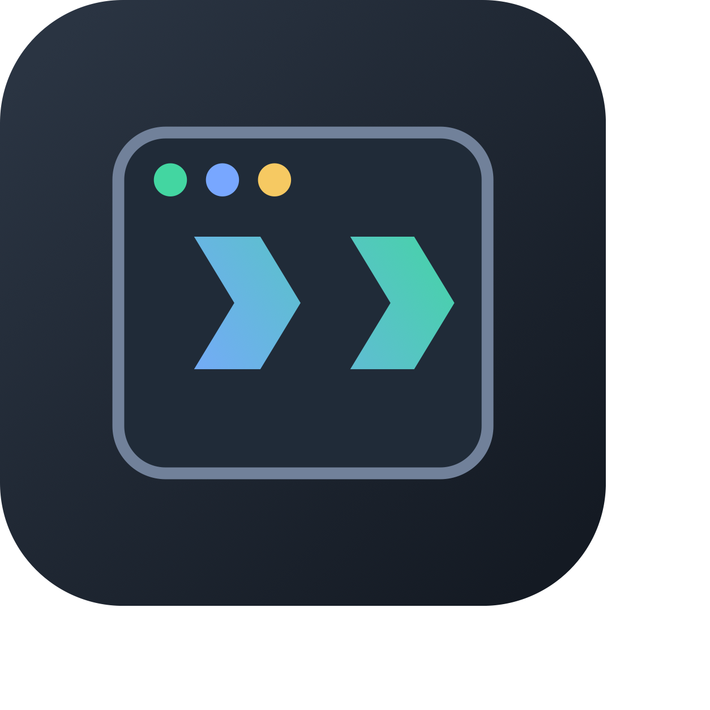

<p align="center">
  
</p>

# DSHKer Launcher

一个桌面入口，连接本地与远程的 DeepSeek Harness 工作空间。

[English](README.md) · [使用说明](docs/usage.zh-CN.md) · [产品截图](docs/screenshots.md) · [最新版本](https://github.com/ankye/dshker/releases/latest) · [GitHub Actions 构建](https://github.com/ankye/dshker/actions/workflows/package.yml)

## 核心功能

- **多台电脑，一个工作台**：管理可信 SSH 连接，测试完整 DSH 会话链路，在固定的本地与各电脑运行标签间切换，无需手动复制 DSH Web 认证凭据。
- **一键启动 DSH Web**：准备内置 Harness 初始版本、选择内核提交，并启动标准 DSH Web 命令。
- **内核版本管理**：刷新远端历史、查看提交，并明确切换 Launcher 管理的 DSH 内核。
- **扩展管理**：查看已安装扩展，并浏览 Awesome DSH Plugin 精选目录。
- **控制台与固定运行标签**：查看精确进程输出、终止受管进程，并始终保留一个本地标签与每台已登记电脑的固定标签。
- **Token 消耗汇总**：只读汇总原生 DSH 会话与每日模型数据，不写入原生 DSH 数据。
- **清晰的数据边界**：Harness、插件、预设、设置与原生 `~/.dsh` 数据分别保存在声明目录，应用不会静默替换它们。

DSHKer Launcher 是面向 macOS 与 Windows 的 [DeepSeek Harness](https://github.com/deepseek-ai/deepseek-harness) 桌面启动器。

Launcher 不会替换、迁移或重置 DSH 原生数据。你已有的 `$DSH_HOME` 或 `~/.dsh` 始终归 DeepSeek Harness 所有；切换内核版本时会继续沿用。


上方 Logo 与工作台插画直接复用当前源码中的应用素材。界面实拍见[产品截图](docs/screenshots.md)；已发布安装包可能落后于 `main` 分支。

## 远程连接

把多台电脑的 DSH 集中到同一个桌面入口，无需将 DSH Web 暴露到网络。当前桌面连接方式为 **SSH 隧道**，将 HTTP 与 WebSocket 流量转发到远端 DSH 实际使用的回环地址和端口。

- **电脑管理**：添加名称、主机、SSH 端口与用户名，支持编辑连接记录、删除不再使用的电脑；修改连接参数前需先断开。
- **先测试，再连接**：验证 SSH 认证、远端 DSHKer 握手及 DSH 访问。测试通过与正在连接是两个独立状态。
- **状态一目了然**：绿色表示就绪或测试通过，红色表示失败，同时显示文字状态；支持主动连接与断开。
- **固定运行标签**：保留一个本地标签，每台已登记电脑各有一个不可关闭的固定标签；断开连接不会删除电脑标签。
- **无需手动复制 DSH Token**：通过已认证链路获取 DSH Web 凭据。仍需配置 SSH 认证；应用不接收 SSH 密码，也不传输私钥。

连接步骤：

1. 在远端电脑运行 DSHKer，并确认它能够启动受管 DSH Web 会话。
2. 配置远端 SSH 服务，通过系统 OpenSSH 配置或 agent 验证访问，并完成主机密钥信任校验。
3. 打开**远程连接**，填写电脑信息，先点**测试**，再点**连接**，然后进入**运行**中的对应电脑标签。

表单填写的是 **SSH 端口**，不是 DSH Web 端口。DSHKer 获取实际 DSH 地址，不假定端口为 `3080`。若提示 `remote.peer_unavailable`，请检查远端 DSHKer 是否运行、能否提供 DSH 会话；仅 SSH 服务可访问还不够。

### 开发中：自托管 P2P 远程工作台

独立的 [DSHKer Server](https://github.com/ankye/dshker-server) 提供分用户网络与认证设备配对。直连传输和 DSH 客户端导航扩展已有本地诊断验证，但**正式桌面接入、远程工程目录选择和双端完整验收尚未完成**，不能视为当前桌面或已发布版本的可用功能。进度见[实现清单](openspec/changes/add-self-hosted-p2p-dsh-connections/tasks.md)。

## 安装

1. 打开[最新 GitHub Release](https://github.com/ankye/dshker/releases/latest)。
2. 下载对应平台的安装包：
   - **macOS Apple Silicon**：名称包含 `mac-arm64.dmg` 的资产
   - **macOS Intel**：名称包含 `mac-x64.dmg` 的资产
   - **Windows x64**：名称包含 `win-x64.exe` 的资产
   - **Windows ARM64**：名称包含 `win-arm64.exe` 的资产
3. 使用 Release 中的 `checksums.txt` 核对安装包，手动安装后启动 **DSHKer Launcher**。

当前 Release 安装包尚未签名。macOS 可能需要在 Finder 中右键选择“打开”，Windows 可能显示 SmartScreen 提示。请只安装来自本仓库、且已核对校验和的资产；应用不会在后台静默替换自己。

如果仓库尚未发布任何 Release，“最新版本”链接会明确没有可用的更新源。[GitHub Actions 打包记录](https://github.com/ankye/dshker/actions/workflows/package.yml)仍作为短期构建和诊断证据，但不是 Launcher 的更新源。

## 检查 Launcher 更新

打开**设置 → Launcher 设置 → 版本更新**可检查固定的 DSHKer GitHub Release 源。Launcher 启动后也会在后台检查，不阻塞主窗口；仅当 GitHub 返回更高的稳定语义版本时才显示启动提示。网络或更新源失败不会在启动时弹窗打扰，可在设置页查看失败状态并主动重试。

发现新版本后，点击**下载**会在系统浏览器中打开与当前平台严格匹配的 macOS arm64 或 Windows x64 安装包。资产缺失、重复或平台不受支持时会明确报错，不会改选其他文件。由于当前 macOS 与 Windows 安装包尚未签名，安装仍由用户手动完成。

## 首次启动

首次运行会自动建立以下 Launcher 自己管理的目录：

| 目录                      | 用途                                   |
| ------------------------- | -------------------------------------- |
| `~/.dshlauncher/harness`  | 选中的 DeepSeek Harness 内核与构建产物 |
| `~/.dshlauncher/plugins`  | 精选插件目录源代码                     |
| `~/.dshlauncher/presets`  | Launcher 下载的预设源代码              |
| `~/.dshlauncher/settings` | Launcher 偏好与记录                    |

若 Harness 目录为空，应用会在后台解压内置 DSH、安装锁定依赖并构建。准备完成前“一键启动”保持不可用，但主界面不会被阻塞。

需要时可按侧边栏顺序使用：

1. **启动**：确认选中提交并启动 DSH Web。
2. **控制台**：查看精确进程输出并终止 Launcher 管理的进程。
3. **版本管理**：刷新、切换和查看内核及扩展。
4. **Token 消耗**：查看原生 DSH 会话日志和每日模型汇总。
5. **设置**：管理 DSH 与 Launcher 设置，包括检查新版本。
6. **远程连接**：登记、测试、连接并监控可信 DSHKer 电脑的仅回环 SSH 隧道。
7. **运行**：使用固定的本地与远程电脑标签打开已连接的 DSH Web 会话。

完整步骤、排障方式与目录归属说明见[中文使用说明](docs/usage.zh-CN.md)或[英文使用说明](docs/usage.en.md)。

## 本地开发

需要 Node.js `^20.19.0 || >=22.12.0` 与 npm `>=10`。

```bash
npm ci
npm run dev
```

常用检查：

```bash
npm run environment:check
npm run format:check
npm run architecture:check
npm run type-check
npm test -- --run
npm run service:smoke
npm run visual:smoke
npm run build:electron
```

## 打包与发布

`package.json` 是 Launcher 版本号的唯一来源。`npm run dist:*` 脚本分别生成 macOS arm64/x64 与 Windows x64/arm64 的本机未签名安装包。稳定版 `v*` tag 必须与 `v${package.json.version}` 完全一致；四个目标全部构建通过并核验清单、校验和后，GitHub Actions 会创建公开的 latest Release，附带四个安装包、合并后的 `checksums.txt` 和按平台命名的清单。手动触发工作流只上传 Actions Artifact，不会发布 Release。

详细交付流程见 [docs/release.md](docs/release.md)，CI 规则见 [docs/ci.md](docs/ci.md)。

## 开源地址

- [DSHKer Launcher](https://github.com/ankye/dshker)
- [DeepSeek Harness](https://github.com/deepseek-ai/deepseek-harness)
