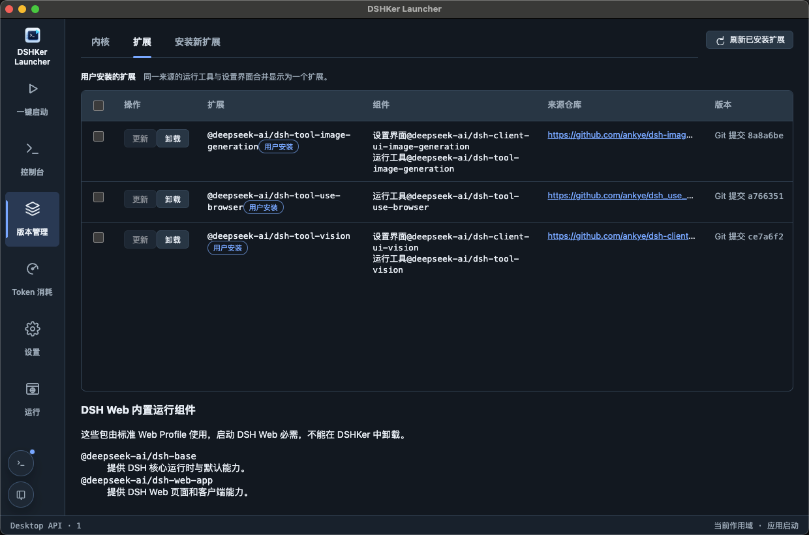
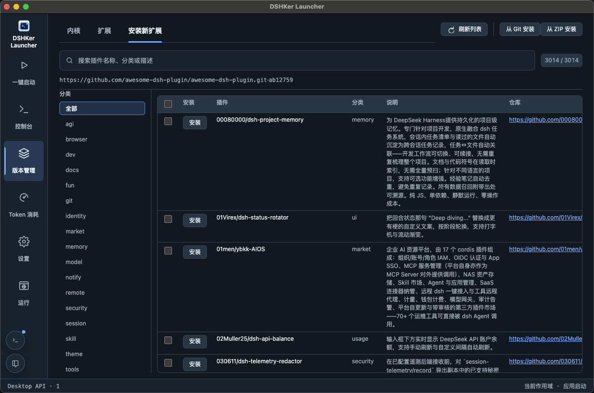
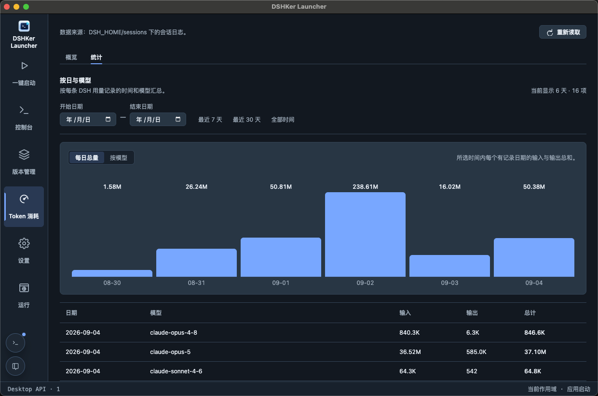

# Product screenshots / 产品截图

These images show the current DSHKer Launcher interface. They are supplied from a real macOS session rather than a browser or development server, and include a prepared Harness checkout, running DSH Web process, installed extensions, plugin catalog data, and session usage data.

以下图片来自当前 DSHKer Launcher 的真实 macOS 使用场景，不是浏览器或开发服务器截图；截图包含已准备的 Harness 内核、运行中的 DSH Web、已安装扩展、插件目录与会话 Token 数据。

## Launch / 启动

## Version management / 版本管理

## Installed extensions / 已安装扩展

## Plugin catalog / 安装新扩展

## Console / 控制台

## Token usage / Token 消耗

## Token statistics / Token 统计

## Settings / 设置

## Run / 运行

