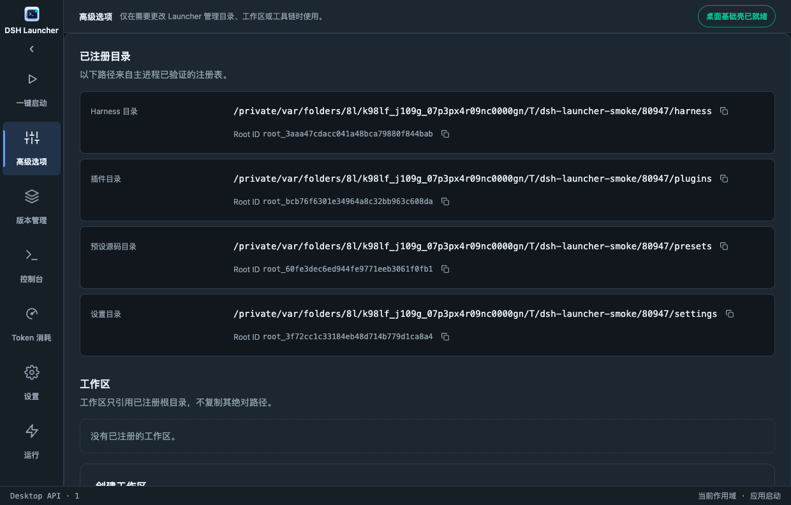
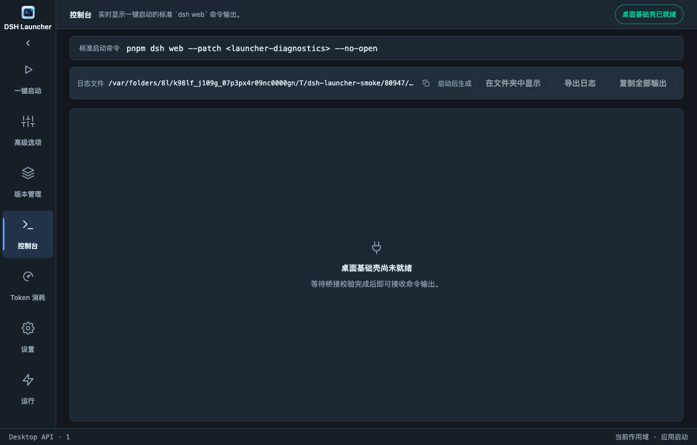
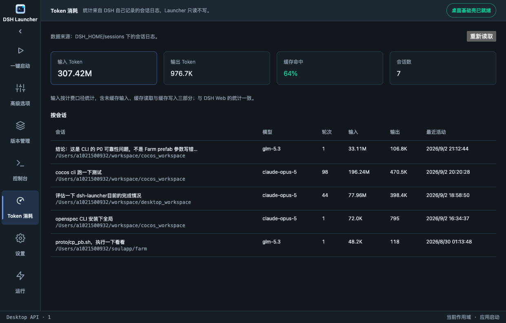
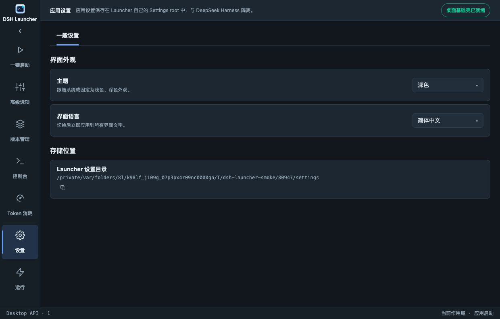
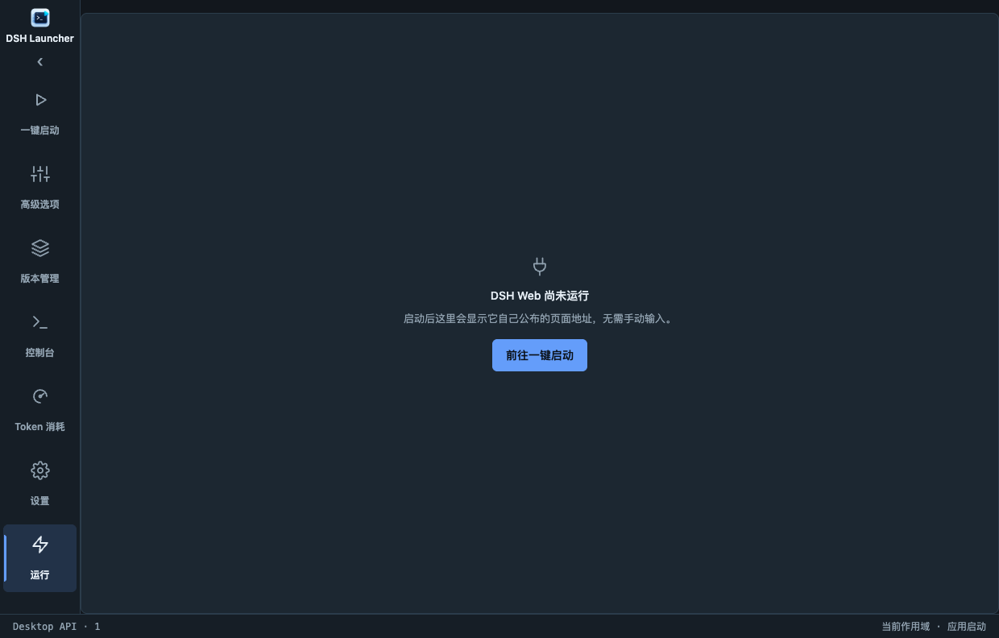

# Product screenshots / 产品截图

These images are captured by the macOS packaged-app smoke run. They are not browser or development-server screenshots. The smoke environment intentionally starts without a user-managed Harness checkout, so the Launch and Version management pages demonstrate their first-run and empty states.

以下图片由 macOS 安装包的烟测直接截取，不是浏览器或开发服务器截图。烟测环境不会读取用户的 Harness 目录，因此“启动”和“版本管理”页面展示的是首启与空状态。

## Launch / 启动

## Version management / 版本管理

## Advanced options / 高级选项

## Console / 控制台

## Token usage / Token 消耗

## Settings / 设置

## Run / 运行

