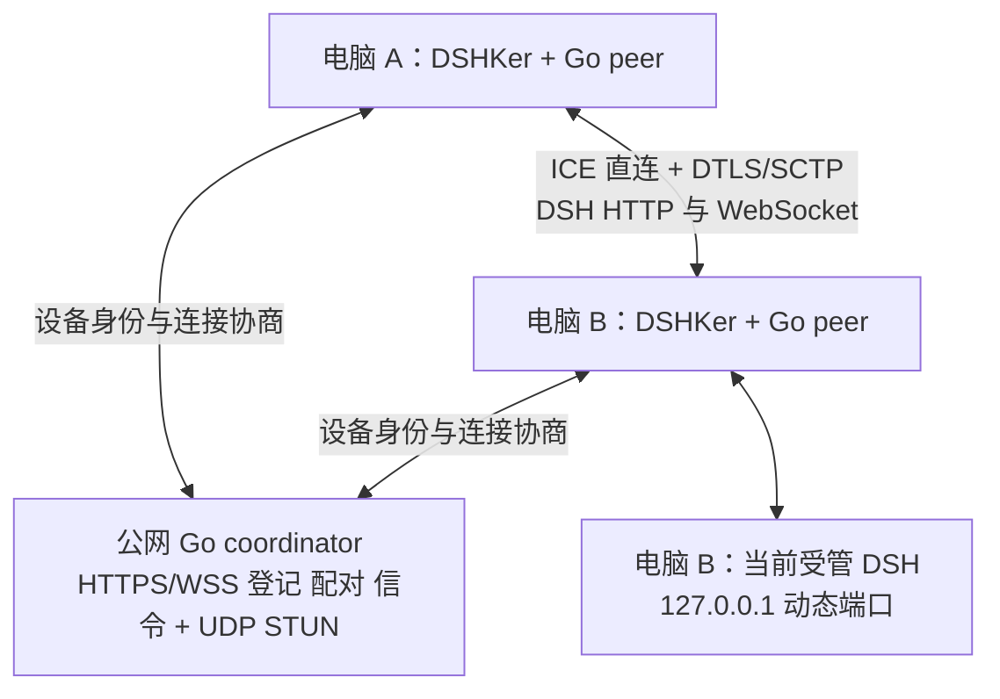

## Context

2026-09-10 Connect-tab alignment: the saved SSH computer list precedes its
in-card add disclosure. Testing, connection actions, status and errors remain
visible; edit/remove are grouped under per-computer management. P2P local
identity and actual coordinator status share one summary row. The exact device
ID and membership settings use separate native disclosures. Required network
ID input remains visible with source guidance. Existing typed operations,
exact-target identities, pending guards and drafts are unchanged. Validation
uses component tests and an isolated visual entry, not production P2P evidence.

2026-09-10 network/account layout refinement: names and explicit selection own
the primary network list; internal user/network identifiers are disclosed with
their troubleshooting purpose. Each network is a compact aligned row; editing,
capacity and destructive actions appear only after expanding its management
region. Selected devices are contextualized by network name, while operations
continue to bind the original IDs. Existing pending/uncertain guards, draft
preservation and exact-target deletion confirmation remain unchanged. See the
dated Agent Note for visual roles and review evidence; this does not mark the
full P2P implementation or production-interface acceptance complete.

见 [proposal.md](proposal.md)。本设计以用户最新澄清为准：Go 自研服务器，DSHKer 连接客户端，ZeroTierOne 仅参考。

当前 `v0.1.21` 的 SSH 模式通过 SCP 获取 peer descriptor，再建立 broker 和 DSH 两条隧道。`RemotePeerBroker` 从 Launcher 当前启动状态取得 DSH URL，`OpenSshRemoteConnector` 解析其中的端口；此动态端口原则继续沿用。SSH 认证、SCP、descriptor 路径问题不由 P2P 模式修复，也不作为新模式的依赖。

用户已确认同时补齐远程 Tab 的操作界面和修改功能。现有 `RemoteConnectionsPanel.vue` 与 remote-connections domain 只有 create/test/connect/disconnect/remove，没有 edit/update；新增编辑必须贯通持久化、typed IPC、domain 和固定标签，不能只增加按钮。

此前调查中的 SSH 目标实际属于发起探测的 Mac；这类 200 响应只能证明 Mac 自连，不能当作 Windows 客户端验收。后续测试必须记录两端不同的 device identity、物理机器和网络路径。

参考证据（2026-09-07）：

- ZeroTierOne checkout `899352e38`：`node/Peer.cpp` 的 rendezvous introduction、`node/IncomingPacket.cpp` 的 `_doRENDEZVOUS` 展示地址交换与联系对端；`node/Switch.cpp` 同时有 direct 和 upstream relay。它说明“节点在线”不能证明业务直连，不是本方案代码来源。
- [ICE RFC 8445](https://www.rfc-editor.org/rfc/rfc8445)：候选地址收集和连通性检测。
- [WebRTC Data Channels RFC 8831](https://www.rfc-editor.org/rfc/rfc8831)：SCTP/DTLS 上的数据通道。
- [Pion WebRTC](https://github.com/pion/webrtc)、[Pion STUN](https://github.com/pion/stun)：Go 协议库。具体版本在实现依赖锁定任务中固定。

## Goals / Non-Goals

**Goals:** 自己部署协调服务；两端 DSHKer 配对后建立认证直连应用隧道；无需复制 DSH Token 或 SSH 私钥；在本机选择获授权远端工程并完成真实 DSH 对话/文件操作/任务执行及断线恢复；保持端口动态性、独立会话和稳定标签；用分阶段错误、远端读回与实际数据路径证明完整工作流。

**Non-Goals:** ZeroTier 兼容网络、虚拟网卡、替代系统 VPN、任意 TCP/SOCKS 代理、通用文件/命令代理、远程桌面、文件自动同步、TURN/业务中继、全 NAT 直连保证。用户已经授权完整实现后发布；发布仍受全部质量及平台门禁约束，不在规划完成时自动放行。

## Decisions

登记结果恢复的 renderer 状态与本地凭据状态分离：读取 pending 文件不能证明服务器未完成登记，保留结果未知并要求查询原 request/key 的结果。只有该 revision 的权威 enrollment_not_found 才开放一次显式重提，发出前消费该权限；任何重新读取凭据或失败查询使旧权限失效。服务级忙状态不改变正在执行操作的恢复状态。此控制不替代 main 的 revision、身份和加密持久化准入，也不解决首次登记与凭据丢失的历史区分；后者在完整登记界面交付前仍须补齐。

### 1. 自研控制面，使用标准协议实现数据面

选择 Go coordinator + Go peer helper + Pion WebRTC。服务器负责信令和 STUN；DTLS/SCTP 会话终止于两台 peer，不终止于 coordinator。helper 在用户态运行，随 DSHKer 启停，Electron main 保留本地 DSH 所有权。

WSS 转发受限的 offer/answer/candidate，不转发 DataChannel 帧或 DSH 内容。STUN Binding 只报告观测到的源地址，不承担配对、认证或通用数据转发。首期使用 UDP ICE；拒绝 `relay` candidates 和 TURN URL。公开 STUN、SSH、WebSocket 中继不作为失败后的替代路径。

备选方案：原生 Electron renderer WebRTC 会让新网络权限和业务会话进入页面进程；选择 Go helper 将两平台协议逻辑、连接监督和测试集中到主进程侧。自行编写 UDP 可靠传输/密码协议缺少必要收益；选择已有协议库。ZeroTier 内嵌及系统 VPN 已因用户明确的参考边界排除。

### 2. 单服务器部署，显式配置、持久身份

独立服务器仓库 `ankye/dshker-server` 提供 Gin API、账号、网络、设备绑定和配对认证。其 `go.mod`、数据库、配置和部署入口自包含，不依赖 NetHopper、OneIsland、NATS、DSHKer 源码或上层 go.work。下面的服务器路径属于该仓库，peer 路径属于 DSHKer 的 `networking/`：

| 路径                                              | 所有权                                                            |
| ------------------------------------------------- | ----------------------------------------------------------------- |
| server `cmd/dshker-server`、`internal/coordinator/` | Gin HTTPS/WSS、用户私有网络、设备绑定、配对、限流、STUN |
| `cmd/dshker-peer`、`internal/peer/`               | ICE/DTLS/DataChannel、帧流量控制、客户端身份、helper 生命周期     |
| `internal/protocol/`                              | 严格版本化的信令和 peer 帧合约                                    |
| server `cmd/dshker-server` 管理子命令 | 本地 init、创建/禁用账号；用户经 HTTPS 管理自己的网络和绑定凭证 |
| `deploy/`                                         | 独立服务器 Docker/systemd 模板、健康检查、升级与恢复说明          |
| `electron/main/p2p/`                              | helper 监督、OS 凭证存储、typed IPC、当前 DSH 绑定与 browser 入口 |
| `src/app/domains/remote-connections/` 和 shell    | 已授权设备、配对确认、状态、固定标签、typed locale 文案           |

服务器显式配置 HTTPS 公网 origin、TLS 证书/密钥文件、WSS origin、UDP STUN 监听及公告地址、数据库路径、设备签发密钥路径。HTTPS 通常使用 443、STUN 通常使用 UDP 3478，但这些只是部署示例，配置字段不可缺失。用户的服务器地址、域名和凭证未提供，本提案不猜测目标。

使用事务型 SQLite 存设备公钥/证书标识、批准的设备关系、已哈希的一次性登记凭证、撤销版本和审计事件；信令 SDP/ICE、在线心跳、连接 attempt 状态仅驻留内存并有期限。首次部署用明确 init 命令创建身份和数据库；已有数据库损坏/缺失所需密钥时停止，不能生成新身份覆盖旧网络。管理入口仅服务器本地，不向 peer 下发管理员令牌。

首期 Linux amd64/arm64 提供独立服务器制品；公网 HTTPS/WSS 和 UDP STUN 的健康检查分别验证。STUN 对来源和全局设置预算、报文长度限制，拒绝非 Binding 消息，不能成为开放代理。普通重启从当前数据库恢复配对和撤销，在线状态重新确认。备份恢复不是普通重启：先校验 schema/原身份，再由显式 recover 命令向不存在的目标创建新签发身份，并使备份中的全部设备证书、配对和邀请失效，只保留审计/展示资料。客户端看到身份变化必须重新登记配对。禁止复制旧备份覆盖线上 DB 后沿用旧密钥运行；即使同 schema、同身份的备份也可能早于撤销。原状态不覆盖，恢复结果不能宣称保留原授权。没有不可回滚外部台账时，不支持带授权的透明恢复。

### 3. 设备登记与配对建立身份信任

每台电脑本地生成设备 Ed25519 身份私钥，存入主进程拥有的安全存储。macOS Keychain、Windows DPAPI 保护持久密文；安全存储不可用就失败，不存明文。私钥只交本机 helper 内存使用，不经 renderer、日志、命令行参数或服务器传输。

用户管理编排由 main 的 `PeerAccounts` 持有每服务短期用户会话，公开返回值仅含用户/网络身份和展示字段；登录密码、Bearer token 不进入 projection 或目录。登录须独立查询当前用户并匹配登录回复后才接受，过期令牌禁止继续发送，helper 关闭清除会话并拒绝迟到回复恢复。操作锁按 serviceId 隔离。网络创建/改名用服务端返回的 networkId/userId/name 再列举读回，不用同名推断身份；无变化不写入，失败不自动重发。网络删除确认后必须通知 owning connection workflow 清理该网络授权，即使随后的结果读回失败也不得恢复旧授权。显式登出先清本地会话；远端登出失败继续返回错误而非声称撤销成功。设备身份和配对不因用户登出自动替换，完整 UI/IPC/连接撤销编排仍是独立接入任务。

主进程凭据实现将每个 serviceId 的设备身份、密钥和证书作为整体，经 Electron safeStorage 加密后写入已登记 settings root 的 `dsh-launcher/p2p-credentials/<serviceId>.json`。明文目录配置仍属于 `p2p-devices.json`，不向 renderer 返回密文或解密结果。首次登记显式 create，已存在拒绝覆盖；更新检查原密文 revision 和设备/用户/公钥身份，原子替换并解密读回。删除只由已完成撤销或已持久 tombstone 的服务工作流调用；凭据文件缺失、损坏或不可解密不能触发自动重新登记。

1. 管理员在独立服务器本地创建账号；用户在 DSHKer 配置 HTTPS 服务、登录并显式选择或创建自己的私有网络，再申请 5 分钟单次绑定凭证。没有默认网络、跨用户配对或匿名注册。HTTPS 必须正常校验证书；用户会话仅用于管理，设备 mTLS 用于信令。
2. helper 生成公钥与 CSR，证明私钥持有；服务器原子消费限定 userId/networkId 的凭证、绑定 deviceId 并签发设备证书。后续设备 REST/WSS 使用 mTLS，绑定凭证不成为长效客户端凭证。分享码、配对和授权租约必须限定明确网络，双方均需属于该用户且有有效绑定。删除网络、解绑设备或删除配对会撤销相应授权，重绑不恢复旧配对。
3. B 在“分享配对码”生成 5 分钟、单次、至少 128 bit 熵的目标凭据；码包含版本、服务身份、B 的 deviceId/公钥指纹、有效期和服务签名，不含私钥或 DSH Token。A 在“添加 P2P 电脑”粘贴该码，main 验证同服务、非自身、签名/期限后提交邀请，服务器原子消费凭据；这是未知本地目标唯一的邀请准入入口，不开放设备目录或裸 deviceId 邀请。B 明确批准且 A 确认显示的 B 身份指纹后，双方保存彼此公钥、服务身份及 pairId。在线或知道 deviceId 不等于获准访问。
4. 后续连接使用已保存的配对授权，不要求复制密钥或每次重新批准。发起时服务器签发绑定双方 deviceId、pairId、attemptId、权限、撤销版本的 60 秒租约；两端每 20 秒续期。收到撤销事件立即关闭；控制面不可用时最迟在租约到期关闭，明确牺牲无限离线使用以界定撤销窗口。

设备删除、重新安装丢失私钥或指纹变化要求重新配对，禁止按显示名/IP 自动信任替代身份。服务器可拒绝连接、处理地址和在线元数据；它不持有设备私钥或 DSH Token。

配对身份读回使用设备 mTLS `GET /v1/pairs/:pairId/identity`，仅向该配对当前参与者返回双方公开 deviceId/userId/publicKey/name、当前 presence 和配对版本。邀请/批准阶段可用于展示并核对身份，但不授予连接权限；过期、撤销、解绑及第三方请求拒绝。客户端验证双方身份与网络后，由明确批准/指纹确认流程固定公钥，不从名称/IP 猜测公钥。测试驱动的内存 pin 不代表 main OS 安全存储或 UI 已实现。

设备 mTLS 证书有效期 30 天，剩余 7 天时通过仍有效证书及同密钥 CSR 显式续期；身份绑定稳定 deviceId + Ed25519 公钥，不绑定证书字节/serial。续期按 requestId 幂等保存，回复丢失可使用旧有效证书查询原结果。旧证书自然到期前仍有效；被撤销设备不能续期。证书已过期则需新的管理员单次凭证及原密钥证明恢复证书，原身份与配对保留；密钥改变、服务 recover 或设备被撤销不得走此恢复，必须新登记/配对。新设备登记、续期与过期恢复使用不同命名操作。

### 4. 版本化信令绑定认证身份和 DTLS

信令 envelope v1 含 `version`、`type`、`messageId`、`attemptId`、`generation`、`fromDeviceId`、`toDeviceId`、`pairId`、`sequence`、`expiresAt`、`payload`、`signature`。签名基于明确字段顺序、带域分隔的规范编码；v1 拒绝未知字段/类型/版本，不尝试兼容解析。服务器从 mTLS 身份校验 sender，限制目标为已批准关系，校验 attempt 成员、长度、序号、过期和消息频率。

offer/answer 由持久设备密钥签名，签名覆盖完整 SDP（包含 DTLS fingerprint 与 ICE 凭证）；candidate/end-of-candidates 绑定该 attempt 和 SDP 摘要。接收方验证保存的 peer 公钥、服务租约、签名和 DTLS 实际 fingerprint，再开放业务通道。重放、串线和信令篡改均失败。首期每一对设备只允许一个发起中的 attempt；同时拨号由服务器原子占有 attempt，另一方得到 `p2p.connection_busy`。

控制面连通、STUN 成功、ICE candidate 收到均不等于 ready。只有候选对已提名、两端 candidate 均非 relay、DTLS 身份验证完成、DataChannel 协议协商通过且 DSH 应用检查通过才进入 ready。每次重新建立会话生成新 generation；旧信令、旧 helper 回调和旧 DSH 公告不得恢复新连接。

### 5. 仅桥接受管 DSH，读取实际运行端口

peer 控制 DataChannel 暴露 `runtime.connect` / `runtime.state` / `runtime.invalidate` 与有限的 stream 操作，并支持下述经过授权的命名工程选择操作；不提供通用 shell、任意文件读写、任意目标 host/port、HTTP CONNECT 或 SOCKS。远端 main 按本地启动合约获取正在运行的 DSH URL；运行未启动时才调用受管 start，并等待真实启动公告。缺失根、工具、profile、未知选定版本、脏 checkout 等错误继续由本地运行时拒绝。

认证直连上返回含 runtime generation 的会话信息。发起端生成一个 `127.0.0.1` 临时入口，仅映射该 peer 的当前 DSH；目标端为每个 stream 绑定本地当前公告中的 loopback authority。端口来自 URL，不能从界面已保存但未生效的设置推断，不能写死 3080。保存端口后旧进程仍使用旧端口；进程重启公告新 URL/Token 后旧 streams 失效，用户重连获取新 generation。

运行时接入细化：`LauncherHarnessService` 提供仅 main 可订阅的实际 launch 状态事件及快照；启动公告、错误、退出和停止在同一 owner 更新，保存端口不发布替代运行公告。`PeerRuntimeOwner` 订阅此源而非轮询 Git/界面状态，为每次实际 running 身份分配递增 generation；离开 running 时同步退役旧绑定并通知连接 owner。多个连接请求共享一个受管启动，已由其他入口发起的 starting 只等待真实公告。每个等待者可独立取消并受 70 秒预算约束，不停止已经接受的 DSH 启动；直接启动的前置失败保留原 typed error。关闭解除订阅、拒绝等待者且不停止 DSH。该模块必须通过正式 main/helper callback composition 才构成完整桥接，不单独计作端到端完成。

业务 DataChannel 采用可靠、有序传输。每个浏览器连接分配 streamId，用版本化 `OPEN/DATA/FIN/RESET/WINDOW_UPDATE` 帧复用；帧包含 attempt 与 runtime generation。最大单数据帧 16 KiB、每 peer 最多 64 条 streams、所有发送排队总和最多 8 MiB，读端受 credit/背压约束，不依赖无限缓冲。控制消息最多 64 KiB，未知 stream、超预算和无效序列明确失败并释放资源。

复用实施细化：每方向固定 128 KiB 初始窗口，OPEN 宣告本端接收 credit，对端首个 WINDOW_UPDATE 确认反向 credit；仅消费实际字节后归还窗口，重复/膨胀 credit 拒绝。接收端使用固定环形缓冲，64 流合计最多 8 MiB。发起方奇数、接收方偶数 streamId 各自严格递增且代次内不复用；已退休的已分配 id 只丢弃交叉 RESET 的在途帧，不重建 stream，未知未分配 id 拒绝。FIN 只结束一个方向，数据排空并且双向 FIN 后释放；显式 RESET 不影响其他流。

本地 HTTP adapter 限定 Host 为其实际 loopback authority、拒绝外部 Origin/CONNECT/越权 Upgrade、只支持该 DSH 的普通 HTTP 与 WebSocket。服务端只连接实际公告端口；重定向和绝对 URL 必须经既有 browser 导航策略检查。Cookie、Origin、Host、路径、查询参数与 WebSocket 的映射由真实 DSH 验证锁定，不能重写凭证来制造 200。

普通 renderer 只得到状态/标识。会话 URL 和启动 Token 由 main 提交给受限 Run guest，避免在普通 IPC projection 中暴露远端原始 URL。每个 peer 使用独立 Electron session partition；同一 loopback 主机不同端口不能作为 Cookie 隔离依据。断开销毁该 generation 的入口、guest 会话与 transient Token，不影响 Local 或其他 peer。

### 5A. 远端目录与工程选择

应用隧道替代的是 SSH 的端口转发承载，不是省略转发层。完整路径为本机受限 guest → 当前 peer 的 loopback adapter → 有 credit 的 P2P streams → 远端 main → 当前 DSH 公告的 loopback authority。仅有 UDP/DTLS 连通时不能加载占位页面或开放工程操作。

实施入口先审计支持的 DSH 版本：记录真实源码/API 对工程列举、打开、会话选择、任务读取及目录选择的能力。未核实之前不 invent endpoint、字段或版本兼容。DSH 原生页面若依赖远端 OS 弹窗，改用 Launcher 的命名远端工程选择入口；禁止本机 `showOpenDialog` 返回本机路径作为远端选择。若需 Harness 改动，先补齐跨仓所有权/版本任务再实施，不能默默注入 Web 页面。

2026-09-07 源码审计见 `docs/testing/remote-workbench-api-audit.md`：实际选定 DSH 为 `a66e4702047846cdaa10c66c9d3df3951f5ea70d`。工程/会话创建和状态流存在，但当前选中会话属于网页客户端内部状态，`session.openWorkspacePath` 只是系统文件管理器操作。用户随后已批准补齐客户端扩展，解除此前的所有权待确认项。

客户端扩展由 Launcher 仓库的独立包 `packages/dshker-workbench-client` 所有，经标准 `dsh.client` 插件入口加载，使用实际 Harness 导出的 `ISessions` / `IWorkspaces` 类型与公开方法，不修改用户受管 checkout 或内核。针对显式选定且已构建的 Harness 做类型/制品验证；运行时 bridge v1 缺失或不匹配明确失败。构建工具只包含生产入口，插件包不包含测试、服务端或 Harness 源码。

导航使用该 guest 的隔离 preload 命名能力 `dshkerWorkbench`，只接收 `navigate` / `selection`，携带 requestId、递增 sequence、workspaceId、sessionId 与已核验的远端 canonical path；main 将调用和回执绑定当前 guest/电脑/attempt/runtime generation，renderer 不提供任意 IPC 名或脚本。扩展先刷新真实 session 列表并等待 workspace feed，验证会话归属和路径一致后调用公开 `sessions.open`，从同一客户端 snapshot 返回实际选中身份。不创建新会话、不广播其他客户端、不重放过期指令。并发 busy、10 秒导航超时、销毁取消、旧序号和不匹配读回有明确结果；取消不会自动恢复旧选中状态或停止任务。

远端用户在本机通过原生选择器明确授权可供浏览的根，授权绑定 peer/pair 与稳定 root identity；配对本身不等于整盘浏览许可。已授权后，远程用户在本机完成目录选择，不要求每次到远端点弹窗。授权为空展示“远端尚未授权工程目录”，而不是推断 HOME、磁盘根或最近工程；根新增、变更和撤销由远端用户明确操作。

工程选择界面包含目标电脑/身份标识、远端路径面包屑、目录列表、进入/返回上级、刷新、选择工程与取消；远端已有工程同样标识所属电脑。列表、打开及读回使用严格命名操作，绑定 serviceId/userId/deviceId/pairId、attemptId、runtime generation、rootId、requestId。普通 renderer 得到受限目录展示数据和不透明目录选择引用，不获得任意文件或 shell 能力。引用只能在相同授权和 generation 内解析，旧引用或跨 peer 注入拒绝。

路径规范化与访问检查在远端执行，使用远端平台规则：覆盖 Windows 盘符、大小写与保留名、macOS Unicode/空格/中文、symlink/junction、路径遍历、断开的卷及检查后目录变化。目录真实解析越过授权根即拒绝；不按字符串前缀判断包含关系，不由本机重写远端分隔符。Windows 未明确授权的 UNC/网络共享不枚举、不触发凭据访问。列表分页有固定上限，取消/断连终止请求；无权限、已删除、空目录和服务失败是独立状态。测试时从真实文件系统读回列表内容，不用数组长度证明正确。

授权根只约束 Launcher 的目录选择接口，不能宣称它能沙箱化 DSH 的原生 Agent。打开工程后对话、文件读写与任务仍由远端 DSH 的权限/审批策略控制。UI 在批准远程使用 DSH 时明示此差别，不绕过 DSH 自身审批，不额外开放通用 shell/文件 RPC。

打开工程只在远端 DSH 返回可验证的工程/会话身份后成功；本机显示的电脑、路径、工程和会话必须与远端读回一致。请求接受后丢失回复显示“结果未确认”，先查询原 request/project/session；没有可确定的幂等或读回契约时禁止自动重发。断开、撤销或切换标签不得将旧结果写到其他电脑，也不自动创建替代工程。

### 5B. 任务归属与断线恢复

会话内容、文件修改、命令执行和任务结果通过真实 DSH HTTP/WS 操作，不通过 coordinator 或新通用远程执行 API。当前电脑、工程路径与会话归属持续可见。相同目录名、相同本地字符串或相同会话标题不能作为跨电脑去重依据。

断线只代表失去连接，不能当作取消任务或停止远端 DSH。对断线前已接受的任务保留明确的“远端结果待确认”，禁止自动重放写操作/命令；用户显式重连后，以固定设备身份、新 runtime generation 和原项目/会话/任务身份查询真实状态。若原 runtime 已重启或记录缺失，则显示无法确认，不猜任务成功、失败或已停止。显式停止任务走 DSH 原生停止接口并读回最终结果。

验收使用隔离的真实远端工程：通过公开 UI 选择工程，读取已知测试文件，提交明确文件变更与无外部副作用的任务，独立核验远端文件内容/任务结果及本机未改变；中途断网并恢复，证明没有重复执行。测试工程与 oracle 只存在测试目录，不进入生产代码或最终包。

### 6. 生命周期与可理解的测试状态

设备 presence 与连接生命周期分别建模：presence 为 offline/online/stale；连接为 disconnected → signaling → punching → authenticating → starting-runtime → ready，任何阶段可转 failed/revoked，显式 disconnect 结束为 disconnected。阶段按协议事件推进，不补造成功状态。

默认阶段预算：信令 10 秒、ICE/DTLS 30 秒、DSH 等待 70 秒（包含原有 60 秒启动预算）、应用探测 10 秒。每阶段可取消；耗尽后报告所在阶段，关闭 socket、DataChannel 和本地入口。普通 HTTP/业务 WebSocket 结束、页面刷新及单流 RESET 只回收该 stream，不使整个 peer 失败。ICE/DTLS/DataChannel 失效关闭该 peer；runtime generation 失效关闭该运行会话。信令 WSS 中断禁止新协商，但已有数据面在有效租约内继续，不能提前按业务断线处理；到期或撤销再关闭。控制面心跳每 10 秒，30 秒无心跳标记 stale，不能继续显示 online。

失败必须有结构化 `stage`、typed `code`、可本地化消息、无敏感信息的 attemptId。至少区分 `server_unavailable`、`device_unauthorized`、`peer_offline`、`pair_revoked`、`direct_unavailable`、`identity_mismatch`、`protocol_mismatch`、`runtime_unavailable`、`stream_failed`、`helper_unavailable`，不得全部压成 `remote.peer_unavailable`。

“测试连接”走生产连接流程，验证认证后的 DSH HTTP 和一个实际 WebSocket 握手，然后清理本次连接通道与临时入口；只将 testStatus 设为 passed，不保留 ready URL。执行前说明“远端 DSH 未运行时会启动；测试结束不会停止 DSH”。结果返回 runtimeDisposition（already-running / started-and-retained / not-started）；开始请求被远端接受后取消也不停止 DSH，启动前取消不发启动请求。同一本地 runtime 的并发 start 合并到一个受管启动操作，不能生成多个进程。真实 Connect 成功才启用固定 tab。绿色表示直连且 DSH 可用；红色表示失败/未连接；正在协商使用独立颜色，并始终有文本。

### 7. 仓库、持久化与能力边界

新 P2P 服务配置和已配对电脑写入已登记 settings root 下严格版本化的 `p2p-devices.json`；临时 ICE 地址、DSH Token、helper PID、本地转发端口和失败状态不持久化。新功能首次启用才能创建初始记录；已有记录缺失、损坏、版本未知时明确失败。SSH v1 catalog 保持原格式，不按 IP 自动转成 P2P；仅用户明确的 SSH 编辑可原子更新选定记录的已允许字段。

`PeerServices` 承接已验证服务的登记与重开准入：首次添加只向 helper 发送显式端点和空 pinnedKey，由 Go 正常 TLS/新鲜挑战签名验证取得身份，main 再验证端点/CA/key/版本并按 catalog revision 提交。重开使用已保存公钥，不接受调用者传入替代 key；已忘记服务即使 helper 内存尚有客户端，也不得重新准入。验证期间发生目录版本变化时拒绝覆盖；尚未启用时不启动网络操作。该模块不替代未验证配置草稿、共享服务器编辑、完整登记或忘记清理工作流，后续接入仍须实现这些明确 UI/持久化语义。

目录落盘细化：`dsh-launcher/p2p-enabled.json` 保存 v1 启用标记及随机 catalogId，与 `p2p-devices.json` 中的 catalogId 必须一致；只有两者均不存在才表示尚未启用，单文件缺失拒绝初始化或覆盖。首次启用按完整临时文件同步后排他发布，分步故障保留不完整状态而非自动修复。目录提交按原始文件 SHA-256 revision 校验并串行原子替换，排队前复制输入、写后重新读取；无变化不写盘。服务证书须为规范 Base64 DER、自签 Ed25519 CA，实际公钥及其 SHA-256 serviceId 必须吻合；证书到期不删除记录，在线认证仍由协议客户端校验。持久层禁止修改既有 connectionId 下的服务/网络/配对/设备/用户/固定公钥身份、回退 pairRevision 或将 revoked 恢复 active。普通电脑删除要求先持久 revoked；服务忘记要求先单独持久 tombstone，后续才能移除记录，tombstone 不可删除或用于重新引入旧服务。命名业务层仍负责实时授权、锁定影响集合和停止连接，此存储层不替代它们。

新增 named IPC 包含配置/检查服务、登记、邀请、批准/拒绝、撤销、列出、测试、连接、断开、移除，以及 `remoteConnections.update`、`p2pDevices.updateDisplayName`、`p2pService.updateConfig` 和命名的授权根管理、远端目录列表、工程打开/结果读回操作。逐项编写 sender/未知字段/越权 admission 测试。网络请求和 helper 全在 main 侧；renderer 不得指定 executable、原始文件访问路径、原始 SDP、候选地址或任意转发目标；工程选择仅传回属于当前授权上下文的不透明引用。bridge 版本与 helper protocol 版本匹配后才启用能力，缺版本报错。

helper 由 main 使用固定打包路径启动；主机匹配 darwin-arm64/darwin-amd64/windows-amd64/windows-arm64，缺失制品不能寻找系统程序或另一个架构。main 与 helper 使用应用专用的 Unix domain socket / Windows named pipe，限制当前用户与进程会话访问并验证启动握手；不暴露 TCP 管理口，也不复用 `service/node/` 或遗留 SDK/VFS 传输。

每个 DSHKer 实例拥有一个共享 helper（统一设备身份、presence 与信令），单 peer 失败隔离到该 peer；helper 进程崩溃会使该实例全部 P2P 会话失败并清理，但 Local/SSH 不变。UI 明确该故障范围，不承诺同进程其他 P2P 不受影响，不自动拉起并恢复旧会话。

产品 server/peer 构建入口与测试 composition 分离。测试 fixtures、fake signaling/NAT simulator 放在测试目录或 `_test.go`，生产不能 import、启用或打包这些路径；以依赖图和最终制品扫描验证。

### 8. 远程 Tab 操作界面与编辑合约

#### 页面与入口

用户/网络管理区由用户明确选择固定 serviceId 后打开，跨服务状态隔离，不默认选择首个网络。密码在提交后立即从输入框清除，不进入共享状态。用户身份读回变化清除旧网络列表、选择与编辑状态；网络列表读取失败保留上次读回并显示失败，不能解释为空。创建/改名显示服务器实际返回的 ID/名称，删除先确认准确网络 ID 和授权后果。写入失败除能证明未接受的准入错误外，标为待网络读回，禁止重复写；读取用户不解除网络写入的不确定状态，成功读取网络列表才允许后续操作。删除读回确认后关闭确认区，目标已删除时焦点回到该服务管理标题。服务器明确拒绝用户会话时 main 清除该服务内存登录凭据，允许用户显式重新登录；普通连接故障不擅自清会话。

Renderer 管理适配由 remote-connections domain 的共享 owner 持有文档级递增请求序号、按服务隔离的 pending/outcome 与无秘密的服务草稿。组件重挂载不重置序号，不把其他服务锁住，也不把密码放入共享操作状态。服务区以显式未加载、读取失败、未启用和实际已保存目录区分状态；启用与“验证身份并添加”均是公开按钮，重新读取是结果未确认后的安全操作。取消仅请求 main 终止原操作，原结果未返回前仍占用 pending；迟到取消回复不能覆盖新请求结果。保存失败保留草稿，成功只清理与本次提交仍相同的字段，不擦除期间新输入。该适配仍需接入用户/网络/登记/配对所有控件，服务列表不得显示为已连接电脑。

沿用现有桌面工具页的表单、设备列表、按钮、状态和 typed locale 样式，不引入新的视觉主题。目标是多电脑用户在一次页面访问内配置、配对、连接及修正错误；鼠标和键盘均有完整路径。主入口继续是左侧“远程连接”，Run 中各固定标签只承载会话与针对该电脑的快捷操作，不复制另一套管理状态。

| 页面区域          | 内容与操作                                                                         | 状态与边界                                                                                        |
| ----------------- | ---------------------------------------------------------------------------------- | ------------------------------------------------------------------------------------------------- |
| 协调服务器 / 本机 | HTTPS/WSS/STUN 配置摘要、检查服务器、编辑服务器、本机登记与身份指纹                | 显示未配置、检查中、可达、不可达、未登记、已登记；服务器检查不计为 peer 测试，不显示业务 ready    |
| 配对申请          | 新建配对、收到/发出的申请、对端标识/指纹、批准、拒绝、等待对方、确认指纹、过期结果 | 不公开枚举未授权设备；未配对状态不产生可用 DSH 标签；登记凭证不回显                               |
| 已登记电脑        | 名称、SSH/P2P 模式、目标摘要、presence、连接阶段、测试结果、错误详情               | 明确新增 SSH / 配对 P2P；每行提供测试、连接/取消/断开、编辑、打开标签、撤销配对和移除等适用操作   |
| 编辑区            | 从设备行或断线标签进入，单个可关闭编辑面板，保存/取消及影响范围提示                | 以持久记录预填，不以当前 DOM 文本或缓存错误回填；同一时刻只编辑一个目标，切换目标须处理未保存输入 |
| 固定 Run 标签     | Local 和每台电脑稳定 tab；在线显示受限 DSH 页面，离线显示状态与连接/重试、编辑入口 | 编辑跳转远程页并定位同一记录；成功重连加载同一 tab，重命名不更换 tab identity                     |

“打开标签”只切换到现有 tab，不自动连接，也不新建可关闭标签。名称长、服务地址长、错误多行和中英文切换时，操作区换行且编辑区可滚动；按仓库现有最小窗口与 packaged smoke 尺寸验收，不改变窗口下限掩盖布局问题。状态提供文字、可访问名称和可聚焦错误位置，不能只靠红绿颜色；减少动态效果时仍显示全部状态。

#### 可编辑字段与身份边界

| 对象           | 可编辑字段                                                      | 不可作为普通编辑字段                                                        | 保存影响                                                                                 |
| -------------- | --------------------------------------------------------------- | --------------------------------------------------------------------------- | ---------------------------------------------------------------------------------------- |
| SSH 电脑       | 本地显示名称、host、SSH port、user                              | connectionId、传输模式、DSH 端口/Token、私钥、任意转发地址                  | 名称单独修改不掉线；host/port/user 变更先断开本记录，成功保存后清除旧测试和旧 generation |
| P2P 电脑       | 本地显示名称；“编辑所属服务器”入口                              | deviceId、pairId、固定公钥、service identity、ICE 地址、远端 DSH 端口/Token | 改名称不改远端设备身份、授权或运行进程，固定标签同步改名                                 |
| 协调服务器配置 | 已明确提供的 HTTPS origin、WSS endpoint、UDP STUN 公告地址/端口 | 服务签发身份、设备证书/私钥、其他网络的授权                                 | 作用于该配置关联的全部 P2P 电脑，列出影响范围，全部断开且无测试/协商后才能提交           |

DSH 实际端口从运行公告读取，只作为连接详情，不在此表单修改远端 DSH 启动设置。SSH 与 P2P 模式只在新增时选择，编辑不转换传输模式。

同一协调服务变更访问地址时，main 先用不含设备凭据的 HTTPS 身份探测验证正常 TLS 和已固定的服务签发公钥，再在确认的 HTTPS/WSS origin 上做设备认证/关系检查，验证明确的 STUN endpoint；未知 origin 不接收旧证书或登记凭证，不跟随重定向携带身份。服务端提供绑定请求 nonce、服务身份、协议版本及公告端点的签名说明，限制响应长度及请求速率，不返回设备列表或秘密。同一签发身份和关系校验通过才允许保存新地址；合法 TLS 证书更新不等同于更换服务签发身份。

更换服务身份、设备密钥或目标电脑必须进入单独的重新登记/配对流程，不通过编辑覆盖已固定身份，也不把旧配对授权带到另一服务。失败时旧配置保持已保存状态且连接保持断开，不自动重连旧服务。初次未登记配置可保存格式合法的显式地址，连接检查与登记仍必须单独成功；不能把“已保存”描述成“已验证”。

旧服务器失联时提供独立“忘记此服务器及本地信任”操作，不要求远端撤销先成功。确认面板列出全部受影响 P2P 电脑，并明确“仅本机解除信任，未确认服务器撤销，其他电脑需分别撤销/忘记”。先停止该服务全部本地会话，持久写入拒绝旧 serviceId/deviceId/pairId 的 tombstone，再清除本地证书/密钥密文与记录/标签；失败保留 blocked 本地状态，重试清理，不重新授权。完成后可配置新服务并用新密钥登记；取消或新登记失败保持未登记，不能恢复旧信任。Local、SSH、其他服务不变；不把普通移除自动转换为此操作。

#### 编辑事务、并发及反馈

主进程为记录提供 `configRevision`（允许持久字段规范编码的内容标识，不在 SSH v1 catalog 增加隐含字段）。保存请求包含记录身份、`expectedConfigRevision` 和严格允许的新字段。main 在记录/服务操作锁内重新检查当前配置、连接状态和影响集合，拒绝旧 revision、已移除目标、未知字段、空必填项及非法端口/地址，采用原子持久写入后才发布新状态。服务探测期间锁住关联电脑的新 test/connect/编辑，失败释放锁；最终提交仍校验当前关系和撤销状态。运行态事件更新不会覆盖编辑草稿。

- 仅名称变化：允许在 ready 状态保存；连接和已完成测试不失效，不重载 guest。正在提交、测试、协商或断开时操作返回 busy，UI 明示原因。无字段变化为 no-op，不重写配置。
- 连接参数变化：要求无活跃连接/测试/协商，UI 提供显式“断开”而非保存时自动断开。断开失败不保存。保存成功使受影响记录 testStatus 变为 untested、live 为 disconnected，旧 URL/Token/generation 不可再用；不会自动测试或重连。
- 任一失败：已保存字段和其他记录不变，草稿、列表位置、当前 tab identity 保留；显示具体字段或阶段错误，可修正或重试。持久提交前故障不得产生半份配置；回复丢失时显示“结果未确认”，按记录重新读取确认结果，不猜成功或自动重交。
- 旧 revision：显示配置已变化，保留草稿供核对，用户主动重新载入后再编辑，不自动覆盖新记录。异步结果绑定目标与请求身份，迟到结果不能改到另一个编辑面板。

#### 操作闭环与取消

所有按钮经 domain 共享状态调用 main，不由各面板独立维护 live 状态；本地表单只拥有草稿/焦点。每项请求先显示真实 pending，重复提交由 main 拒绝，不以动画模拟完成百分比。结果以 main 持久状态或服务端授权结果为准。

| 操作                           | 准入与进行中                                                                 | 完成、失败与离开                                                                                                                           |
| ------------------------------ | ---------------------------------------------------------------------------- | ------------------------------------------------------------------------------------------------------------------------------------------ |
| 新增 SSH / 配置服务 / 保存编辑 | 必填字段格式检查后提交；只锁目标及关联范围，不锁其他独立电脑                 | 成功显示已保存并同步记录；失败保留草稿；提交被 main 接收后不能用关面板伪装取消，离开前显示仍在保存，结果归属原目标                         |
| 检查服务器                     | 校验显式端点；展示 HTTPS/WSS/STUN 各自结果，不消费登记凭证                   | 检查不更改 live/testStatus；离开不把晚到结果写入新的服务草稿；失败可修正地址后主动重试                                                     |
| 登记 / 新建配对                | 有效服务配置与明确凭证/目标；只发送一次，展示等待状态                        | 凭证消费结果不明先按本机公钥查询本次登记结果，不自动再次登记；一次性凭证结束或关闭后清除，不存入草稿；配对申请离开页面仍按服务器有效期存在 |
| 批准 / 拒绝 / 确认指纹         | 绑定准确申请 ID 和当前状态；显示对端身份及授权后果                           | 成功才更新关系；过期/已处理/网络错误显示实际结果；不自动批准同名设备，重新进入重新查询                                                     |
| 测试 / 连接 / 取消 / 断开      | 无冲突请求；按真实阶段显示进度；取消/断开等待 main 完成清理                  | 测试仅更新测试结果；连接成功才可加载 DSH；取消后不保留 ready；离开管理页不取消活跃会话，状态由 domain 持有                                 |
| 撤销配对                       | 显示目标与终止访问后果并确认，可对已连接 peer 发起                           | 服务端确认撤销并完成本地清理后显示 revoked；失败不假报撤销，响应不明重新读取关系，不盲目重发                                               |
| 移除记录                       | SSH 要求断开；P2P 要求已确认撤销且断开，无待处理操作；明确确认目标           | 本地持久删除成功后才移除 tab；失败保留记录。若撤销成功但本地删除失败，显示已撤销/未移除，只重试本地删除，不恢复授权                        |
| 关闭编辑 / 切换目标            | 未提交的脏草稿需选择继续编辑或放弃修改，点击外部不隐式丢弃；无改动可直接关闭 | 取消不改持久状态；回到触发按钮，已删除目标则聚焦列表标题；从 Run 进入编辑后可回到原固定 tab                                                |

列表刷新保留已存在目标的选择和滚动；空列表展示新增/配对入口，加载和失败不伪装为空列表。Enter 提交当前表单、Escape 执行上述关闭规则，保存/取消/编辑均有可见按钮和正常键盘焦点。安全敏感登记凭证不适用一般草稿保留规则。拒绝自动保存、删除重建实现编辑、共享全局 pending 锁、按名称重用 tab、失效 URL 占位加载以及修改参数后静默连接等方案。

### 9. 验收及部署先后顺序

用户最新确认先完成本地功能与验证，发布明确的 GitHub 预发布版，再进行 Win/Mac 联测。预发布使用独立 prerelease 版本、禁止 latest/稳定更新源晋级，附本地证据和物理平台待测清单。正式版仍须完成下述跨平台/公网矩阵，不降低现有验收阈值；缺实现、缺本地端到端或包完整性仍阻止预发布。

本地先行验证（2026-09-07）：按用户追加要求，先运行一个独立服务器二进制和两个独立 Go peer 进程，验证真实 TLS/mTLS/WSS、双向批准、公钥固定、ICE/DTLS 直连、压力及断连。客户端仅通过 `GET /v1/pairs/:pairId/identity` 获取自己参与的配对双方公开身份及 presence，不开放设备目录。该层结果只证明控制面与 peer 数据传输，不替代 Electron UI、受管 DSH HTTP/WS 或 Windows 实机验证。后者仍保留未完成任务，不在本地压力结果中冒称完成。

helper 控制协议 v1 使用当前用户私有 Unix socket（Windows 对应 named pipe）。启动随机握手秘密只通过 stdin 交给子进程并在连接时校验，不放 argv；每条 JSON 限 64 KiB，初始化凭据仅进入 helper 内存。暂定命名操作为初始化、连接指定已固定 pairId、断开、发送该 attempt 的有界数据、查询状态；运行证据由独立测试进程消费，不向生产 helper 增加 echo/mock runtime 或测试开关。生命周期以 lease/attempt/generation 为准；取消、关闭、租约拒绝和 peer 进程退出不得回放旧会话。

先锁定 Go/Pion 版本并跑真实两台客户端最小直连，再实现登记配对、DSH 桥接和 UI，最后做平台/网络矩阵。Go server 和 helper 的可执行最小版本也走相同鉴权与协议合约；真实环境检查不由假 server 替代。

验收包括 Windows↔macOS 双向、同 LAN、两公网 NAT、IPv6、UDP 被禁、无法直连的 NAT、服务器中断/重启、撤销、peer 重启、DSH 改端口与 Token 轮换。对成功样本记录真实 device identity、平台/架构、selected candidate pair、应用响应、WebSocket、客户端/服务器业务流量归属；失败样本必须可观察且无中继流量。服务端流量允许信令/心跳/STUN，不能用“服务器零流量”作为标准。

既有 Harness clone/注册/精确版本激活、脏状态拒绝、启动/停止回归继续运行；本 P2P 变更不重建它们的根模型。四架构打包检查必须核对 helper 架构、版本、哈希及真实 app 启停。编译成功不能替代 Windows↔macOS 真实连接。

远程 Tab 与 Run 断线页分别验收新增、编辑预填、保存/取消、重命名不断流、修改参数前断开、共享服务影响范围、保存失败保留输入、旧结果拒绝、撤销/移除部分成功、键盘/焦点及长文案布局。服务可达/设备在线/测试通过/真实 ready 必须是不同证据。未执行的真实 UI 检查保持未完成，文档场景不能当作截图或运行证明。

完整可执行用例见 [tasks.md 第 8 节](tasks.md#8-完整测试用例与追踪)：C 对应协调服务所有场景，D 对应客户端所有场景，X 补充精确边界、故障点和旧功能回归。每行都包含前置/操作、预期与层级，参数化项分别记结果，所有场景到用例 ID 的追踪必须无遗漏。写入用例同时核对 UI、typed projection、持久读回和不变的记录身份；网络用例核对 candidate、真实 HTTP/WS 与资源归属，而非只检查 200。

本变更属于 interactive 风险。实现阶段建立 test-integrity manifest 与公开控件交互合约，记录精确生产/测试文件、字段来源、身份键、六类状态、真实 no-mock 命令及原始 ledger；生产文件长度和 mock 依赖/制品隔离为硬门槛。候选 E2E 只能在实现及前置检查完成后执行，最终采用 verify 而非 static 放行。当前文档阶段不生成空清单、不运行候选验收、不声称实现通过。

发布范围新增远端授权根、目录选择、工程打开、真实文件/任务和恢复全过程。所有新增/修改源码与测试均不超过 1000 物理行。interactive ledger 对用户输入即时反馈沿用 visible P95 ≤500ms、settled P99 ≤1000ms 的既有门槛；远端长操作用真实可见进度表达，其业务超时独立记录，不能伪造完成或放宽门槛。压力验收必须包含真实 DSH HTTP/WS、多 peer/多流/慢读、至少 1 小时持续运行、重复连接与故障后的资源读回；原 90 秒 Go 数据通道测试仅为诊断证据。

只有完整任务与质量证据通过后才提交本次归属明确的代码、推送并创建正式 Release。发布门槛同时核对提交/标签/版本、四个原生 CI 构建与打包 smoke、Release 发布任务及实际资源；不得混入无关脏改动或生成证据。缺 Windows 物理设备、公网验收参数或签名输入时报告真实缺口，不以同机测试放行，也不自动发布残缺功能供普通用户试错。

## Risks / Trade-offs

- [对称 NAT、双重 NAT 或企业防火墙无法建立 UDP 直连] → 明确失败并显示“无法建立直连”；本范围无 TURN，不能承诺全部环境成功。
- [一台公网服务器是单点] → 首期接受，健康检查/备份恢复可重复；控制面中断时禁止新连接，既有连接受 60 秒租约限制。
- [信令服务器能看见候选地址和设备关系] → 限权、数据期限、脱敏审计；不上传 DSH Token/内容，使用已配对公钥校验 DTLS 协商。
- [DTLS 加密存在但对端身份未绑定] → 签名 offer/answer、固定 peer 公钥、attempt 防重放和实际 fingerprint 检查都为会话准入条件。
- [跨多个 browser 请求的 Cookie/Origin/WS 语义不同] → 每 peer 独立 session partition，真实 DSH 端到端验收作为集成关卡。
- [本地端口被抢占或 helper 退出] → typed 失败、generation 清理，用户重连；不接管未知监听器或恢复旧 Token。

## Migration Plan

1. 在现有 DSHKer 仓库创建独立 Go module 和 server/peer 制品流水线，不修改 ZeroTierOne checkout。
2. 使用明确服务器配置启动新 coordinator，验证 HTTPS/WSS/STUN，再分发兼容的新 DSHKer；未配置 P2P 的用户继续使用现有 Local/SSH 功能。
3. 用户选择 P2P、登记并批准配对后新增固定 peer tab。旧 SSH 记录不隐式转换，同名设备不自动合并；用户可主动移除不需要的旧登记。
4. 升级要求客户端 helper、协调服务、wire protocol 明确兼容；未知版本拒绝。停止与撤销必须清理各自临时入口。
5. 回退先停 P2P generations，服务端先备份并按数据 schema 使用匹配版本。保留新配置及配对记录供恢复；不自动删用户数据，不恢复旧运行凭证。SSH 与 Local 不受 P2P 撤销影响。

## Open Questions

服务器公网地址/域名、Linux 架构、证书来源和运维凭证将在部署任务执行前提供；这些值不改变本方案协议和任务边界。此阶段没有真实服务器目标，因此文档完成不等于服务器已部署或 P2P 已验收。
